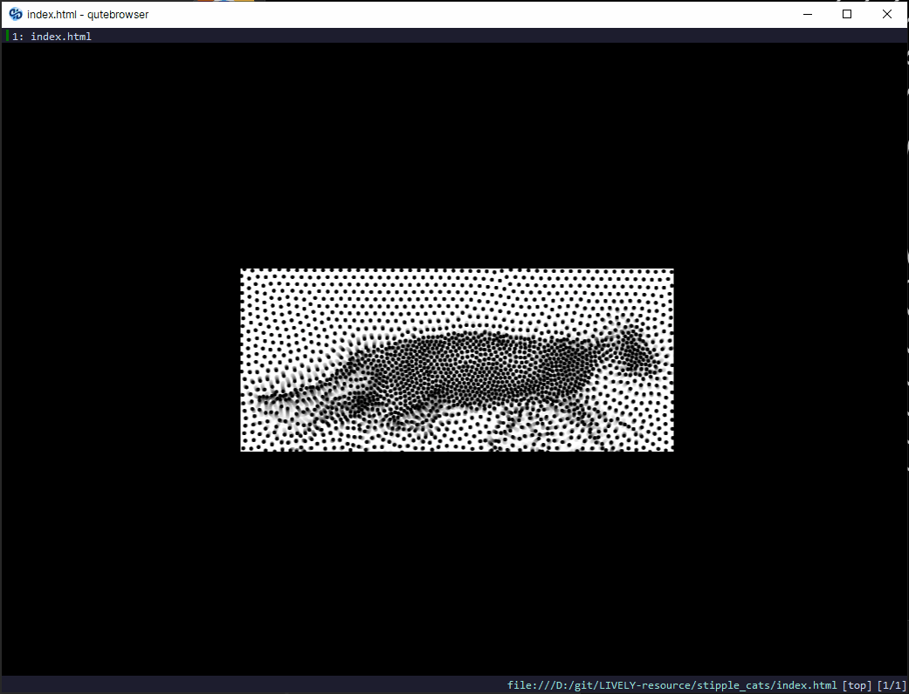

# LIVELY-resource



Resources of [lively](https://github.com/rocksdanister/lively) and [Wallpaper Engine](https://www.wallpaperengine.io/).  
I collect them occasionally. I have made some minor changes in some resources, mainly for offline use (no google-tag, etc...), colors, etc.  
See [data.md](data.md) to get download links and other data.  
See [metadata.md](metadata.md) to get more information about the source, author and license etc.

## Tools

- [Sublime Text](https://www.sublimetext.com)
- [JsPrettier](https://github.com/jonlabelle/SublimeJsPrettier)
- [miniserve](https://github.com/svenstaro/miniserve)
- [HTTrack](https://www.httrack.com/)
- ...

## Notes

1. fork a repository as submodule
2. goto local repository
3. git submodule add .url

## Todo

- [x] add local files of web-wallpaper to this repo, declare `fork`` relationship
- [x] add `.csv` that containing metadata
- [x] add preview-picture
- [x] upload to https://steamcommunity.com/workshop/
- [ ] how download single, [gh-download](https://github.com/yuler/gh-download) or ..
- [ ] see https://docs.wallpaperengine.io/en/web/overview.html?
- [ ] how automatically track repo's upstream updates?
- [ ] make some adjustments on muser, about window and mouse. change the source of the audio file

## Witchcraft 🧙

```cmd
curlie -k https://raw.githubusercontent.com/scillidan/LIVELY-resource/main/data.md ^
  | sd "\[\D+\]\(" "" ^
  | sd "(\)\|\[)" "|[" ^
  | sd "\[\d{10}\]\(" "" ^
  | sd "(\)\|!\S+subsc)" "|