|preview|source|author|license|
|---|---|---|---|
|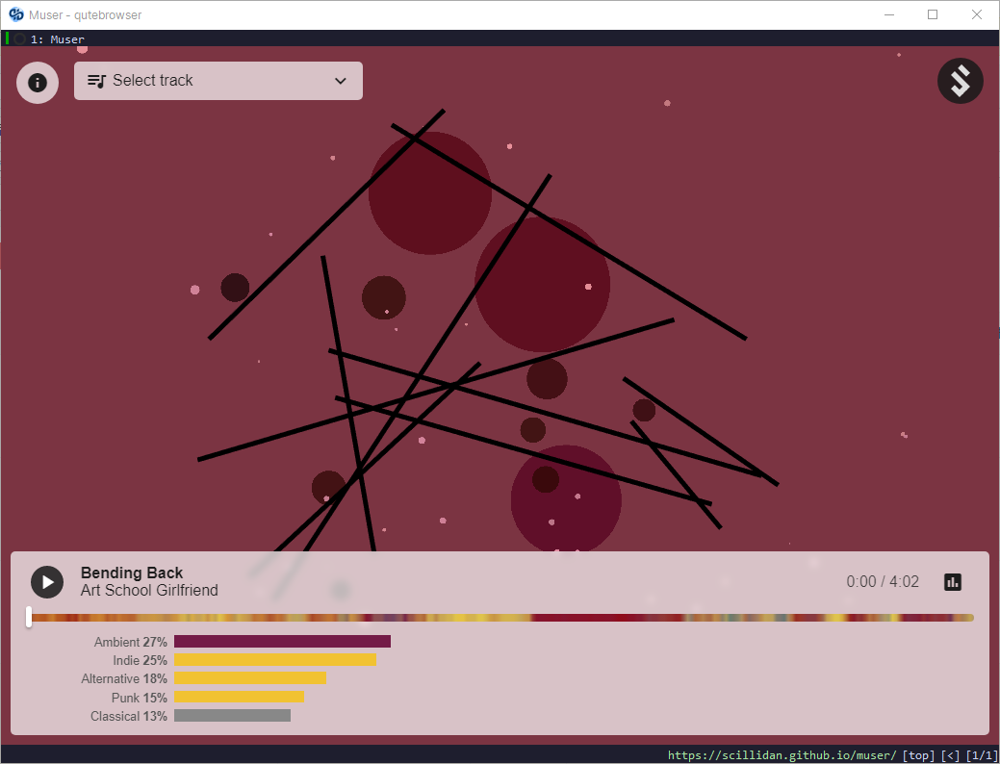|[muser](//github.com/jonshamir/muser)|[Jon Shamir](//jonshamir.com)|[mit](//github.com/jonshamir/muser/blob/master/LICENSE.md)|
|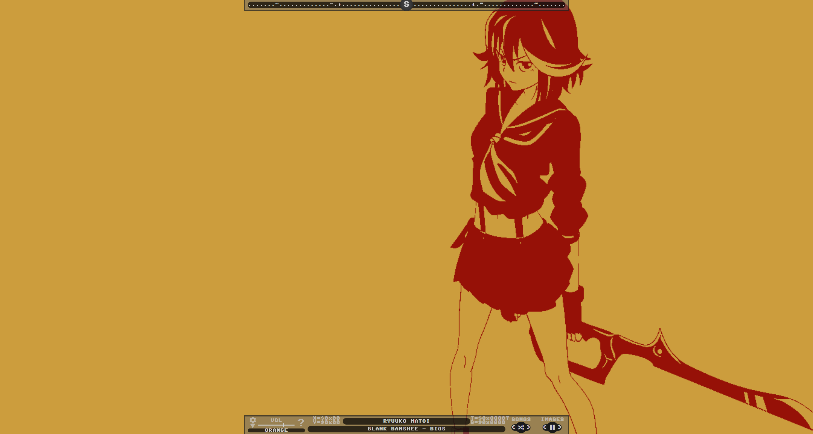|[0x40-web](//github.com/mon/0x40-web)|[mon](//github.com/mon)|[mit](//github.com/mon/0x40-web/blob/master/LICENSE)|
||[ImageTrailEffects](//github.com/codrops/ImageTrailEffects)|[codrops](//tympanus.net/codrops)|[see #license](//github.com/codrops/ImageTrailEffects)|
||[GridRevealEffects](//github.com/codrops/GridRevealEffects)|[codrops](//tympanus.net/codrops)|[see #license](//github.com/codrops/GridRevealEffects)|
||[duskwave](//gist.github.com/mandynicole/f6c1c3083dd5dbb6606bd832f97a10c4)|[mandynicole](//github.com/mandynicole)|[no license](//choosealicense.com/no-permission)|
||[vectorfield](//github.com/tofuness/eex/tree/master/vectorfield)|[DENNIS JIN](//dennisjin.com)|[mit](//github.com/tofuness/eex/blob/master/LICENSE)|
|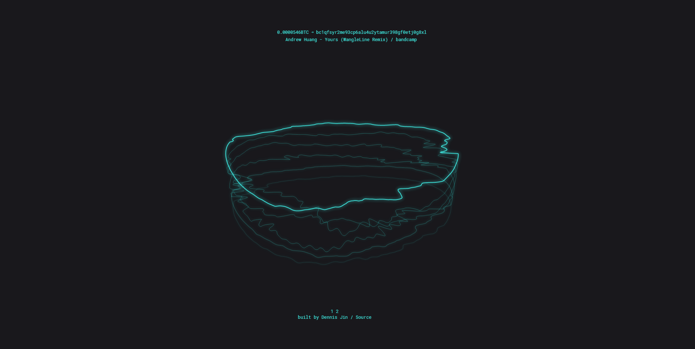|[satoshi](//github.com/tofuness/eex/tree/master/satoshi)|[DENNIS JIN](//dennisjin.com)|[mit](//github.com/tofuness/eex/blob/master/LICENSE)|
|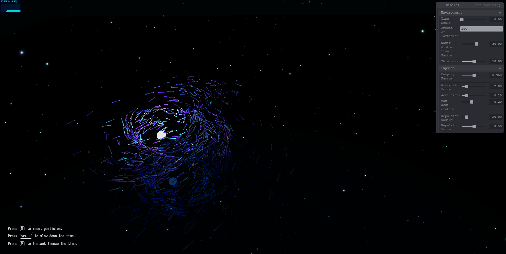|[saturdaynight](//adinunz.io/saturdaynight)|[Arno Di Nunzio](//github.com/Aqro)|[no license](//choosealicense.com/no-permission)|
|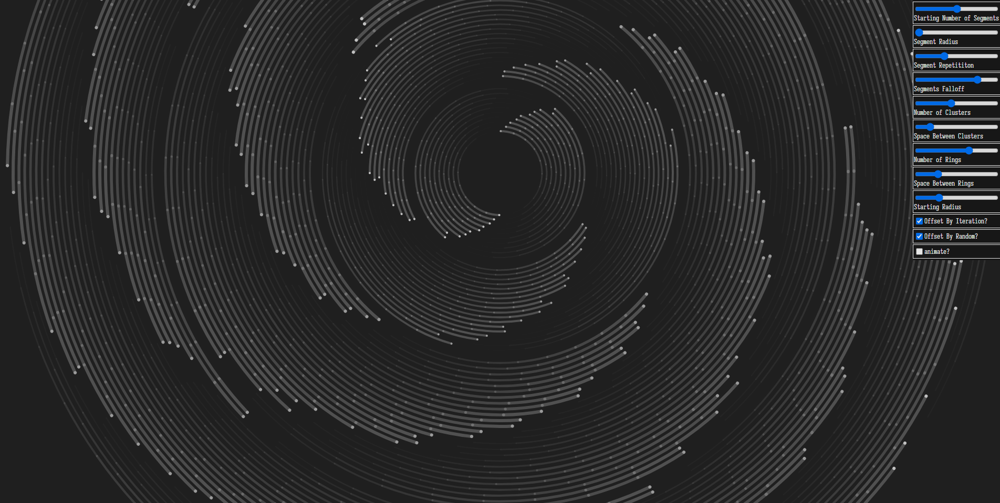|[spiral-canvas-2](//codepen.io/EntropyReversed/pen/OJjMaeP)|[Stefan](//codepen.io/EntropyReversed)|[mit](//blog.codepen.io/documentation/licensing)|
|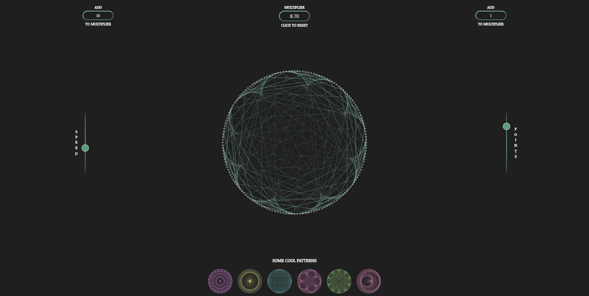|[circles](//codepen.io/EntropyReversed/pen/YBEwXV)|[Stefan](//codepen.io/EntropyReversed)|[mit](//blog.codepen.io/documentation/licensing)|
|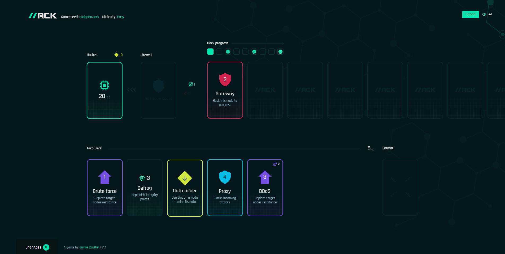|[hack-a-digital-card-game](//codepen.io/jcoulterdesign/pen/abYNyLq)|[jcoulterdesign](//codepen.io/jcoulterdesign)|[mit](//blog.codepen.io/documentation/licensing)|
||[ame-tokidoki-kaze](//openprocessing.org/sketch/1330474)|[Taichi_K](//openprocessing.org/user/290886)|[cc by-nc-sa 3.0](//creativecommons.org/licenses/by-nc-sa/3.0)|
||[bit-patterns](//openprocessing.org/sketch/482981)|[Jason Labbe](//openprocessing.org/user/60876)|[by-sa 3.0](//creativecommons.org/licenses/by-sa/3.0)|
|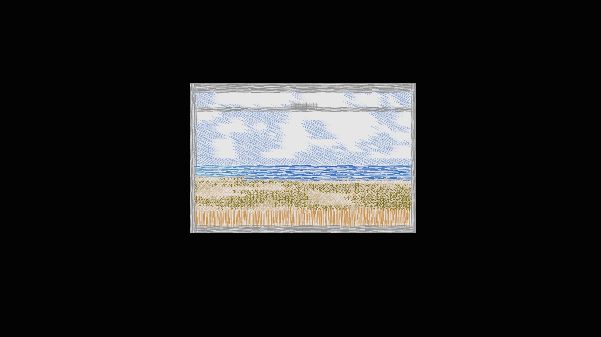|[trainscape](//openprocessing.org/sketch/1592221)|[pitheorem](//openprocessing.org/user/329032)|[cc by-nc-sa 3.0](//creativecommons.org/licenses/by-nc-sa/3.0)|
|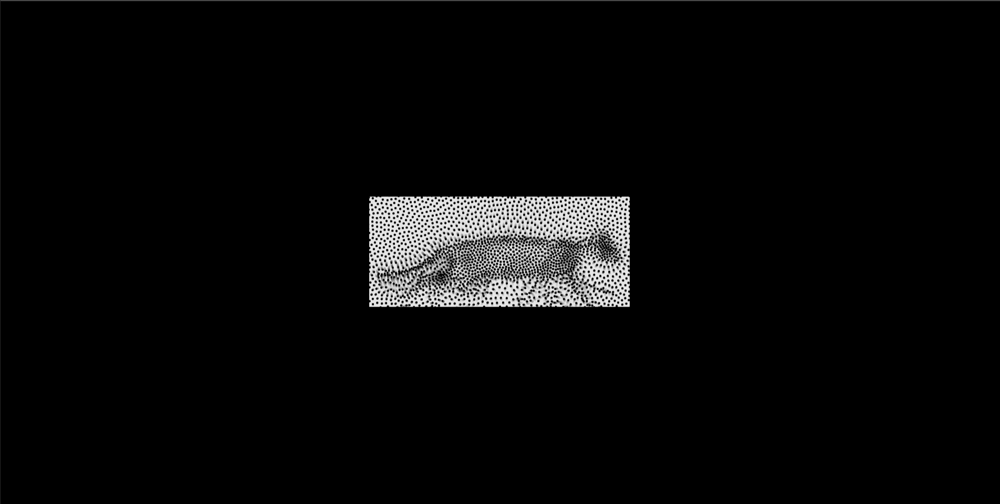|[stipple_cats](//openprocessing.org/sketch/47364)|[Jim Bumgardner](//openprocessing.org/user/1032)|[cc by-sa 2.0](//creativecommons.org/licenses/by-sa/2.0)|
|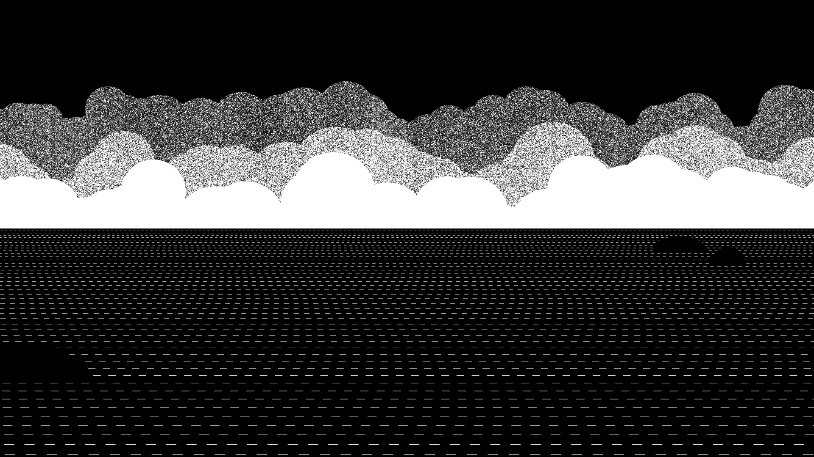|[210215](//openprocessing.org/sketch/1102267)|[Sayama](//openprocessing.org/user/159668)|[cc by-nc-sa 3.0](//creativecommons.org/licenses/by-nc-sa/3.0)|
|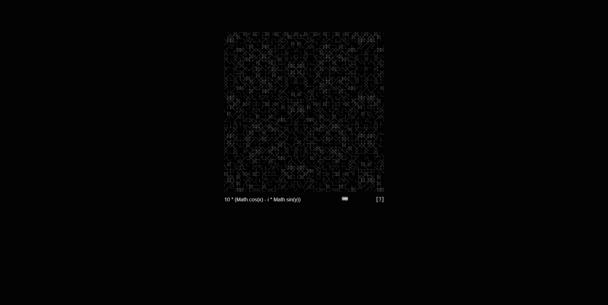|[hexy](//gitlab.com/joshavanier/hexy)|[josh avanier](//avanier.studio/josh)|[no license](//choosealicense.com/no-permission)|
||[orrery](//gitlab.com/joshavanier/orrery)|[josh avanier](//avanier.studio/josh)|[mit](//gitlab.com/joshavanier/orrery/-/blob/master/LICENSE)|
||[concentric](//avanier.studio/concentric)|[josh avanier](//avanier.studio/josh)|[no license](//choosealicense.com/no-permission)|
|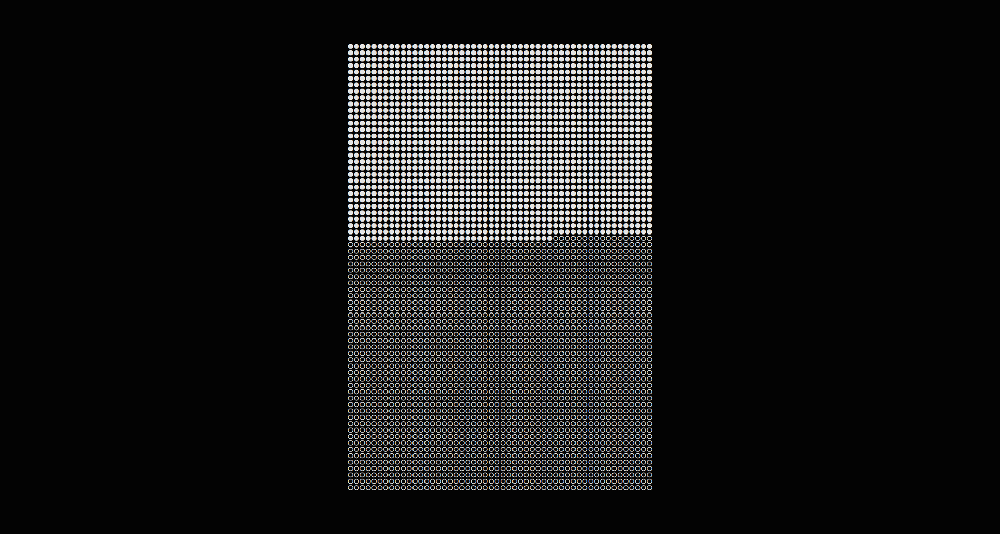|[marbles](//lab.avanier.studio/marbles.html)|[josh avanier](//avanier.studio/josh)|[no license](//choosealicense.com/no-permission)|
|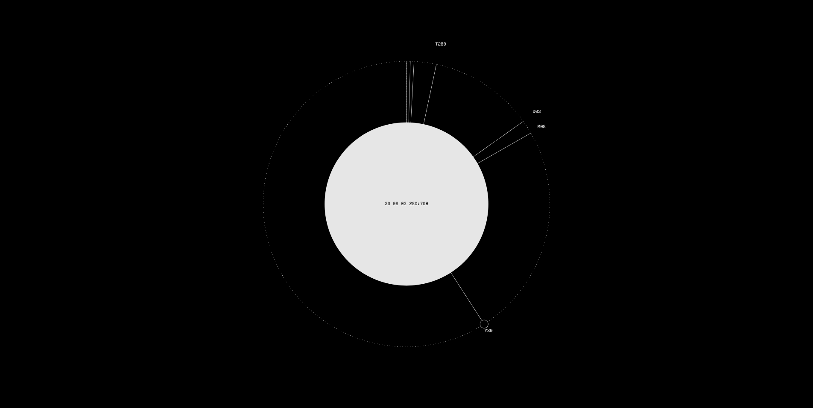|[gaea](//github.com/nomand/Gaea)|[nomand](//nomand.co/#nomand)|[mit](//github.com/nomand/Gaea/blob/master/LICENSE.md)|
||[mortem](//gitlab.com/joshavanier/mortem)|[josh avanier](//avanier.studio/josh)|[mit](//gitlab.com/joshavanier/mortem/-/blob/master/LICENSE)|
|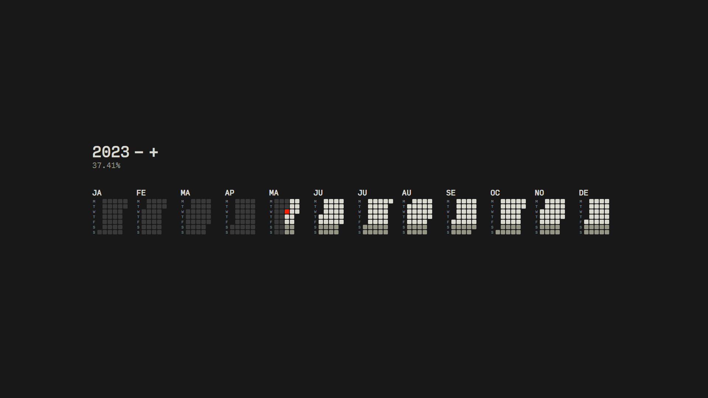|[letnice](//github.com/nomand/Letnice)|[nomand](//nomand.co/#nomand)|[mit](//github.com/nomand/Letnice/blob/master/LICENSE.md)|
|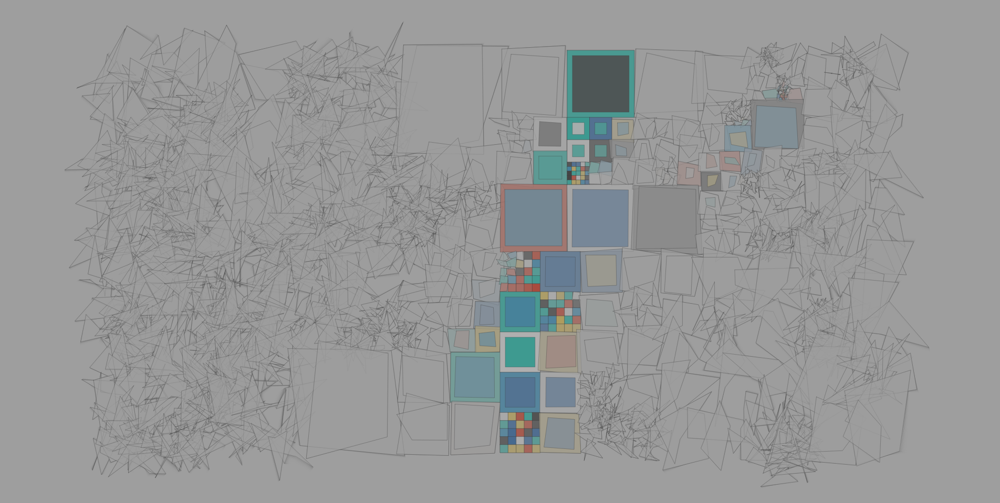|[grid-chaos>order](//openprocessing.org/sketch/859877)|[Jin](//openprocessing.org/user/78622)|[cc by-sa 3.0](//creativecommons.org/licenses/by-sa/3.0)|
|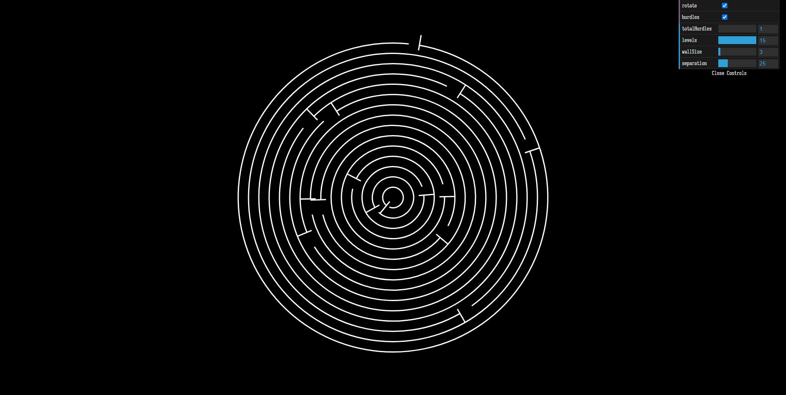|[circular-labyrinth-generator](//codepen.io/JuanFuentes/pen/mgPZpb)|[Juan Fuentes](//codepen.io/JuanFuentes)|[mit](//blog.codepen.io/documentation/licensing)|
|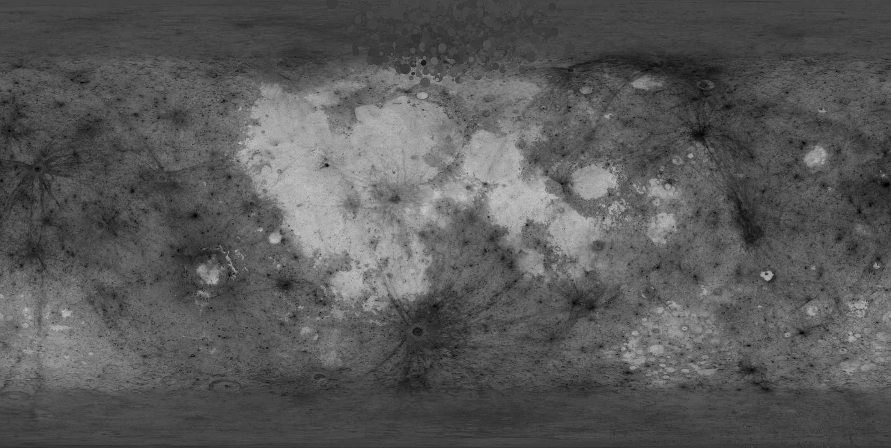|[blueberries](//codepen.io/soju22/pen/MWKJowb)|[Kevin Levron](//codepen.io/soju22)|[mit](//blog.codepen.io/documentation/licensing)|
|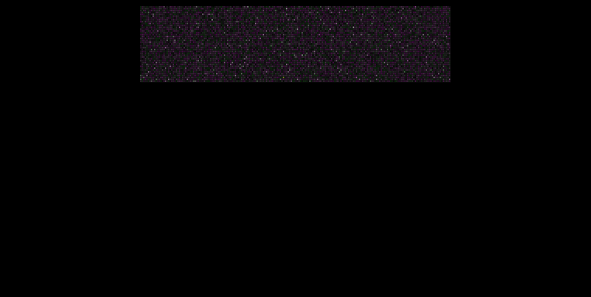|[twinkly-sky](//codepen.io/swartkrans/pen/kPQaYR)|[swartkrans](//codepen.io/swartkrans)|[mit](//blog.codepen.io/documentation/licensing)|
|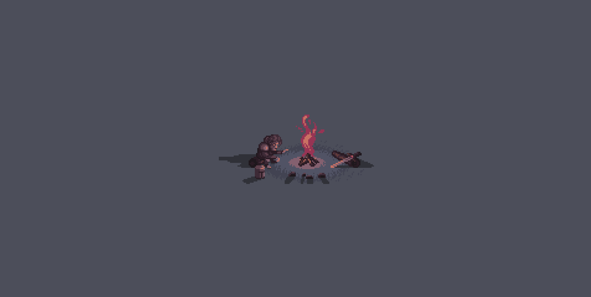|[pixelart-campfire](//codepen.io/jcoulterdesign/pen/yGgxOY)|[jcoulterdesign](//codepen.io/jcoulterdesign)|[mit](//blog.codepen.io/documentation/licensing)|