| source | author | license | preview | lively | wallpaper-engine |
|---|---|---|---|---|---|
| [0x40-web](//github.com/mon/0x40-web) | [mon](//github.com/mon) | [MIT](//github.com/mon/0x40-web/blob/master/LICENSE)  | 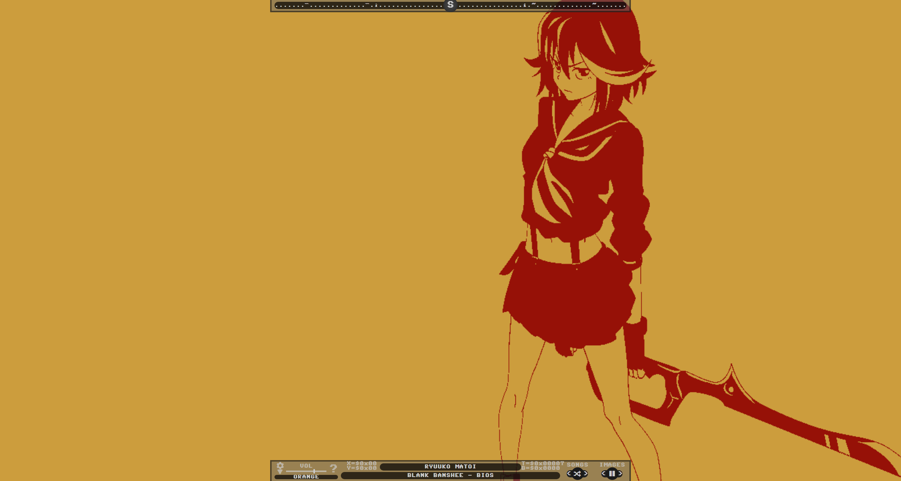 | [Github](//github.com/scillidan/0x40-web)  | [2888591333](//steamcommunity.com/sharedfiles/filedetails?id=2888591333)    |
| [ImageTrailEffects](//github.com/codrops/ImageTrailEffects) | [codrops](//tympanus.net/codrops) | [See #License](//github.com/codrops/ImageTrailEffects#license)  |  | [Github](//github.com/scillidan/karanokyoukai-html)  | [2805327019](//steamcommunity.com/sharedfiles/filedetails?id=2805327019)    |
| [GridRevealEffects](//github.com/codrops/GridRevealEffects) | [codrops](//tympanus.net/codrops) | [See #License](//github.com/codrops/GridRevealEffects#license)  | 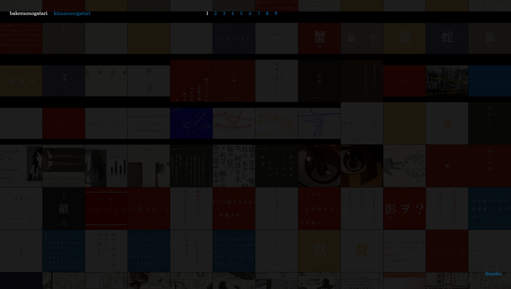 | [Github](//github.com/scillidan/bakemonogatari-html)  | [2805308788](//steamcommunity.com/sharedfiles/filedetails?id=2805308788)    |
| [Perlin Noise Contours](//openprocessing.org/sketch/1989795) | [Rob Baker](https://openprocessing.org/user/269258) | [CC BY-NC-SA 3.0](//creativecommons.org/licenses/by-nc-sa/3.0)  | 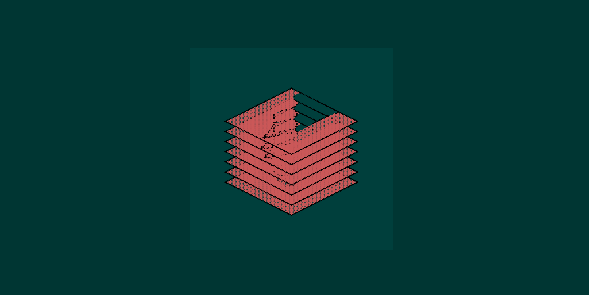 | [Github](//github.com/scillidan/LIVELY-resource/tree/master/perlin-noise-contours)  | [3062690989](//steamcommunity.com/sharedfiles/filedetails?id=3062690989)    |
| [interactiveNoiseLines](//openprocessing.org/sketch/1787558) | [Robert D'Arcy](//openprocessing.org/user/43968) | [CC BY-NC-SA 3.0](//creativecommons.org/licenses/by-nc-sa/3.0)  | 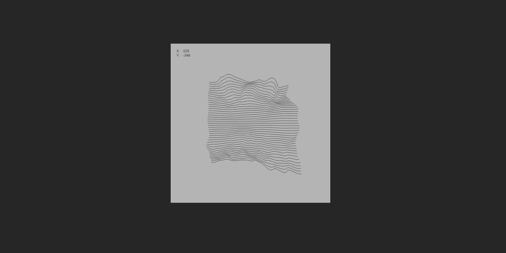 | [Github](//github.com/scillidan/LIVELY-resource/tree/master/interactive-noise-lines)  | [3062667110](//steamcommunity.com/sharedfiles/filedetails?id=3062667110)    |
| [audio-visualizer](//github.com/teoxoy/audio-visualizer) | [teoxoy](//github.com/teoxoy) | [MIT](//github.com/teoxoy/audio-visualizer/blob/master/LICENSE)  | 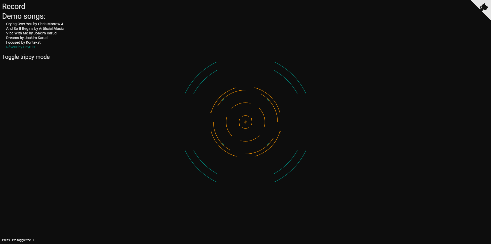 | [Github](//github.com/scillidan/tree/master/audio-visualizer)  | [++](//steamcommunity.com/sharedfiles/filedetails?id=++)    |
| [Fake Perspective](//openprocessing.org/sketch/1989795) | [Sid Chou](//openprocessing.org/user/393990?view=sketches&o=6) | [CC BY-NC-SA 3.0](//creativecommons.org/licenses/by-nc-sa/3.0)  | 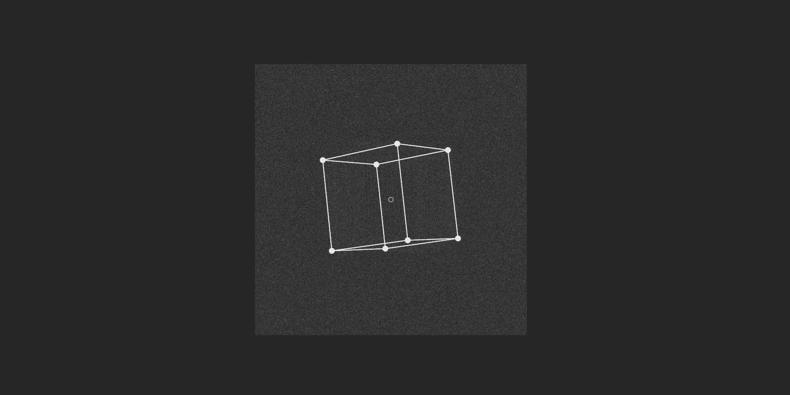 | [Github](//github.com/scillidan/LIVELY-resource/tree/master/fake-perspective)  | [3062655058](//steamcommunity.com/sharedfiles/filedetails?id=3062655058)    |
| [cfr](//github.com/susam/cfr) | [Susam Pal](//susam.net) | [MIT](//github.com/susam/cfr/blob/main/LICENSE.md)  | 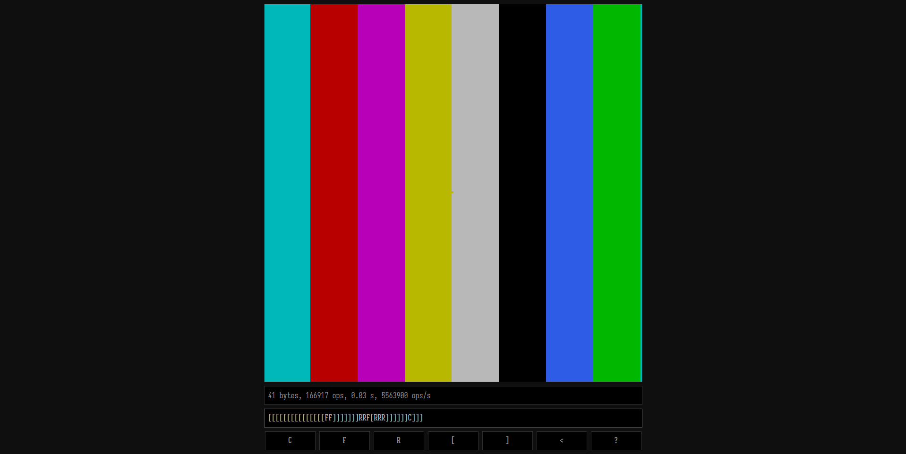 | [Github](//github.com/scillidan/cfr)  | [3058646695](//steamcommunity.com/sharedfiles/filedetails?id=3058646695)    |
| [bellwoods](//github.com/mattdesl/bellwoods) | [Matt DesLauriers](//mattdesl.com) | [See #Copyright](//github.com/mattdesl/bellwoods#copyright)  | 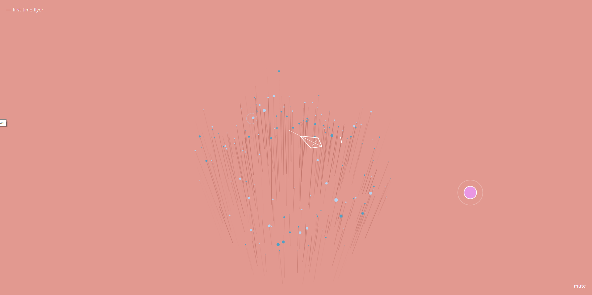 | [Github](//github.com/scillidan/bellwoods)  | [2977016522](//steamcommunity.com/sharedfiles/filedetails?id=2977016522)    |
| [vectorfield](//github.com/tofuness/eex/tree/master/vectorfield) | [DENNIS JIN](//dennisjin.com) | [MIT](//github.com/tofuness/eex/blob/master/LICENSE)  | 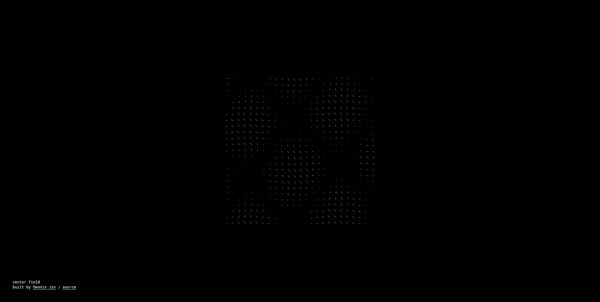 | [Github](//github.com/scillidan/LIVELY-resource/tree/master/vectorfield)  | [2977159119](//steamcommunity.com/sharedfiles/filedetails?id=2977159119)    |
| [satoshi](//github.com/tofuness/eex/tree/master/satoshi) | [DENNIS JIN](//dennisjin.com) | [MIT](//github.com/tofuness/eex/blob/master/LICENSE)  | 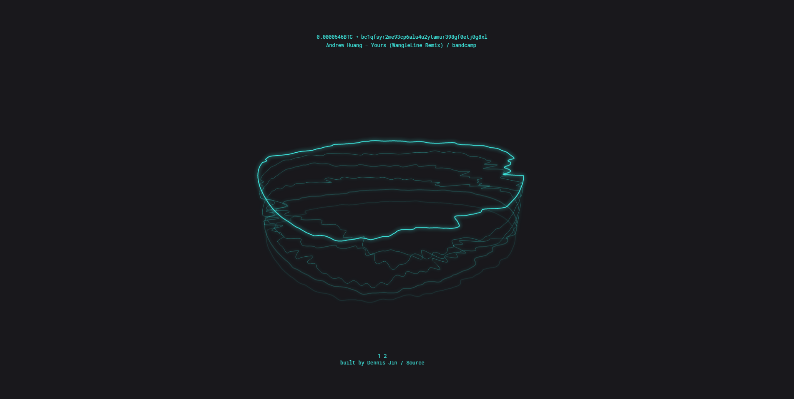 | [Github](//github.com/scillidan/LIVELY-resource/tree/master/satoshi)  | [2977154470](//steamcommunity.com/sharedfiles/filedetails?id=2977154470)    |
| [saturdaynight](//adinunz.io/saturdaynight) | [Arno Di Nunzio](//github.com/Aqro) | [No License](//choosealicense.com/no-permission)  | 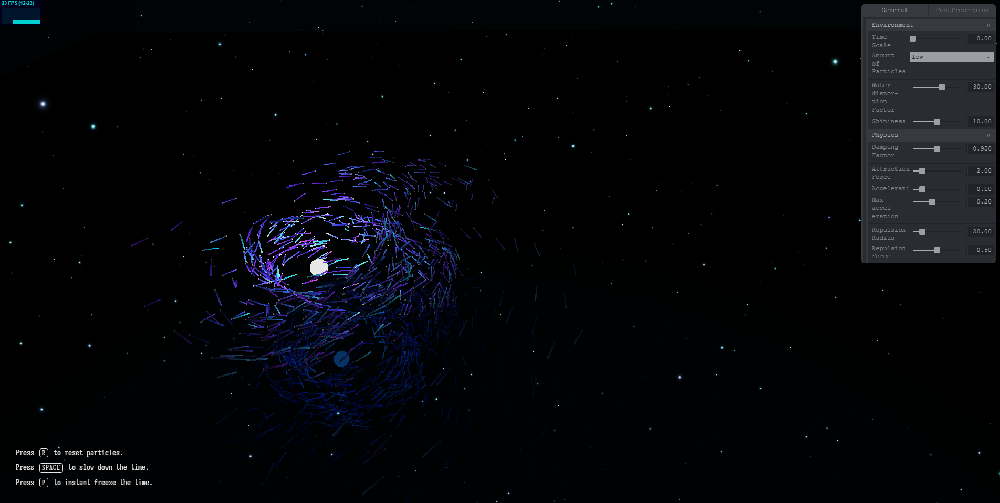 | [Github](//github.com/scillidan/LIVELY-resource/tree/master/saturdaynight)  | [2977150948](//steamcommunity.com/sharedfiles/filedetails?id=2977150948)    |
| [spiral-canvas-2](//codepen.io/EntropyReversed/pen/OJjMaeP) | [Stefan](//codepen.io/EntropyReversed) | [MIT](//blog.codepen.io/documentation/licensing)  | 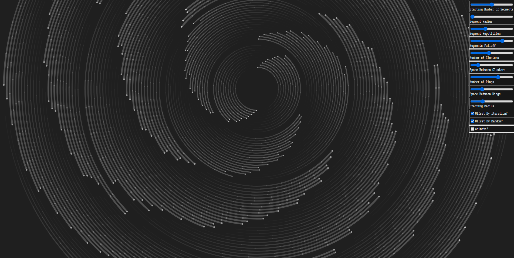 | [Github](//github.com/scillidan/LIVELY-resource/tree/master/spiral-canvas-2)  | [2977145663](//steamcommunity.com/sharedfiles/filedetails?id=2977145663)    |
| [circles](//codepen.io/EntropyReversed/pen/YBEwXV) | [Stefan](//codepen.io/EntropyReversed) | [MIT](//blog.codepen.io/documentation/licensing)  | 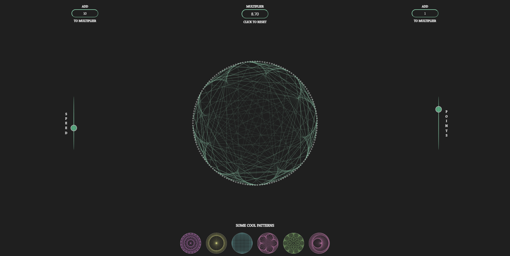 | [Github](//github.com/scillidan/LIVELY-resource/tree/master/circles)  | [2977141839](//steamcommunity.com/sharedfiles/filedetails?id=2977141839)    |
| [hack-a-digital-card-game](//codepen.io/jcoulterdesign/pen/abYNyLq) | [jcoulterdesign](//codepen.io/jcoulterdesign) | [MIT](//blog.codepen.io/documentation/licensing)  | 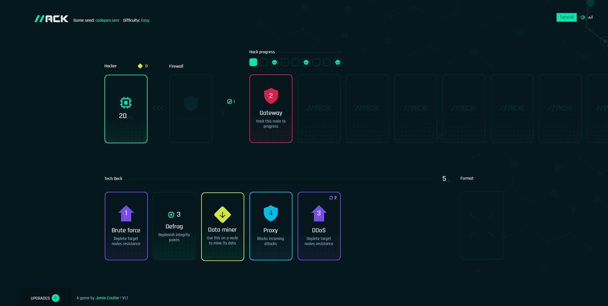 | [Github](//github.com/scillidan/LIVELY-resource/tree/master/hack-a-digital-card-game)  | [2977137036](//steamcommunity.com/sharedfiles/filedetails?id=2977137036)    |
| [ame-tokidoki-kaze](//openprocessing.org/sketch/1330474) | [Taichi_K](//openprocessing.org/user/290886) | [CC BY-NC-SA 3.0](//creativecommons.org/licenses/by-nc-sa/3.0)  | 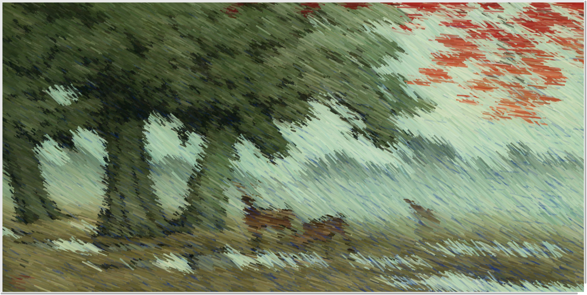 | [Github](//github.com/scillidan/LIVELY-resource/tree/master/ame-tokidoki-kaze)  | [2977132183](//steamcommunity.com/sharedfiles/filedetails?id=2977132183)    |
| [Step](https://codepen.io/woodwoerk/pen/rxrLqa) | [Joe Harry](https://codepen.io/woodwoerk) | [CC BY-NC-SA 3.0](//creativecommons.org/licenses/by-nc-sa/3.0)  | 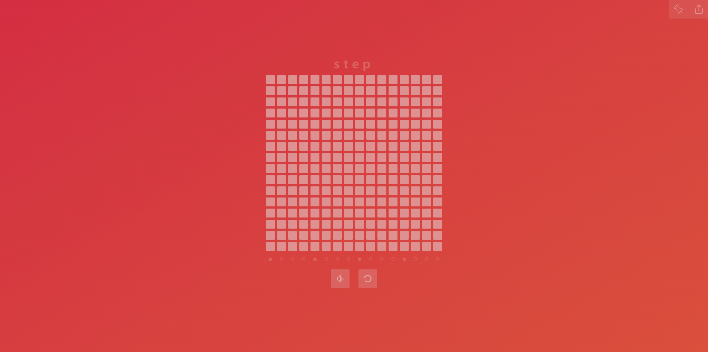 | [Github](//github.com/scillidan/tree/master/step)  | [3149001990](//steamcommunity.com/sharedfiles/filedetails?id=3149001990)    |
| [bit-patterns](//openprocessing.org/sketch/482981) | [Jason Labbe](//openprocessing.org/user/60876) | [CC BY-SA 3.0](//creativecommons.org/licenses/by-sa/3.0)  |  | [Github](//github.com/scillidan/LIVELY-resource/tree/master/bit-patterns)  | [2977127856](//steamcommunity.com/sharedfiles/filedetails?id=2977127856)    |
| [trainscape](//openprocessing.org/sketch/1592221) | [pitheorem](//openprocessing.org/user/329032) | [CC BY-NC-SA 3.0](//creativecommons.org/licenses/by-nc-sa/3.0)  | 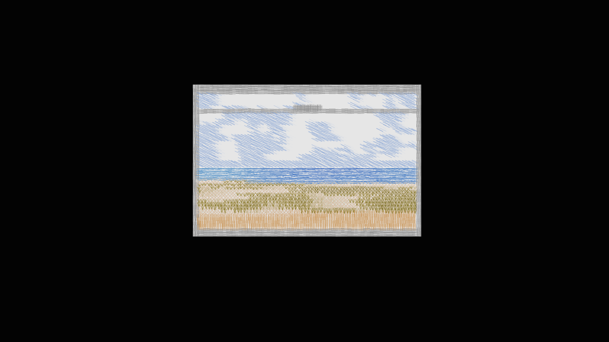 | [Github](//github.com/scillidan/LIVELY-resource/tree/master/trainscape)  | [2977124252](//steamcommunity.com/sharedfiles/filedetails?id=2977124252)    |
| [stipple_cats](//openprocessing.org/sketch/47364) | [Jim Bumgardner](//openprocessing.org/user/1032) | [CC BY-SA 2.0](//creativecommons.org/licenses/by-sa/2.0)  | 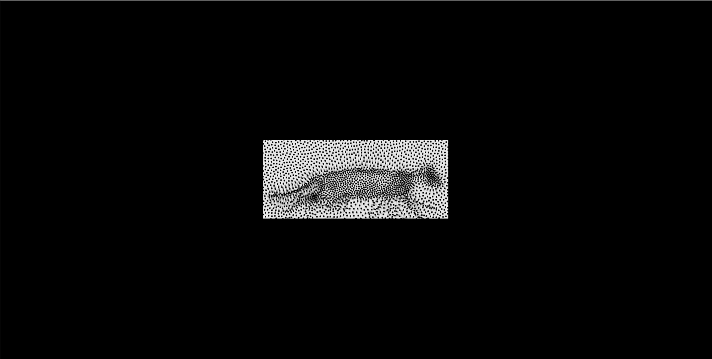 | [Github](//github.com/scillidan/LIVELY-resource/tree/master/stipple_cats)  | [2977120069](//steamcommunity.com/sharedfiles/filedetails?id=2977120069)    |
| [210215](//openprocessing.org/sketch/1102267) | [Sayama](//openprocessing.org/user/159668) | [CC BY-NC-SA 3.0](//creativecommons.org/licenses/by-nc-sa/3.0)  | 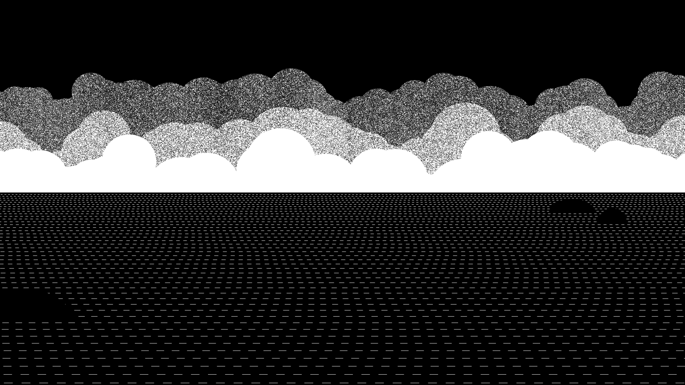 | [Github](//github.com/scillidan/LIVELY-resource/tree/master/210215)  | [2810643785](//steamcommunity.com/sharedfiles/filedetails?id=2810643785)    |
| [hexy](//gitlab.com/joshavanier/hexy) | [josh avanier](//avanier.studio/josh) | [No License](//choosealicense.com/no-permission)  | 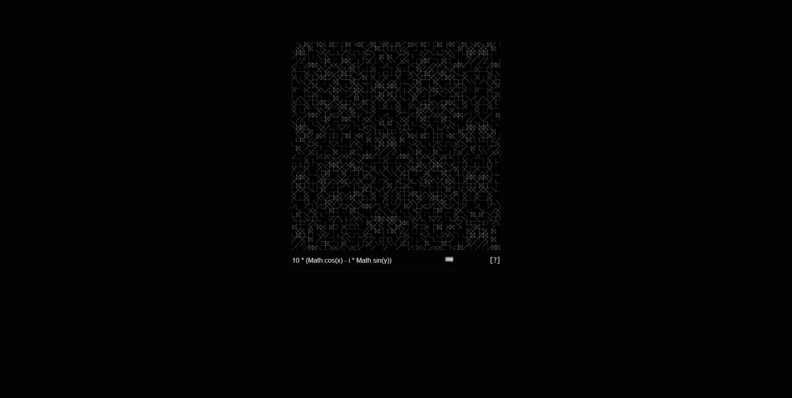 | [Gitlab](//gitlab.com/scillidan1/hexy)  | [2977116504](//steamcommunity.com/sharedfiles/filedetails?id=2977116504)    |
| [orrery](//gitlab.com/joshavanier/orrery) | [josh avanier](//avanier.studio/josh) | [MIT](//gitlab.com/joshavanier/orrery/-/blob/master/LICENSE)  |  | [Gitlab](//gitlab.com/scillidan1/orrery)  | [2977102521](//steamcommunity.com/sharedfiles/filedetails?id=2977102521)    |
| [concentric](//avanier.studio/concentric) | [josh avanier](//avanier.studio/josh) | [No License](//choosealicense.com/no-permission)  |  | [Github](//github.com/scillidan/LIVELY-resource/tree/master/concentric)  | [2977094536](//steamcommunity.com/sharedfiles/filedetails?id=2977094536)    |
| [marbles](//lab.avanier.studio/marbles.html) | [josh avanier](//avanier.studio/josh) | [No License](//choosealicense.com/no-permission)  | 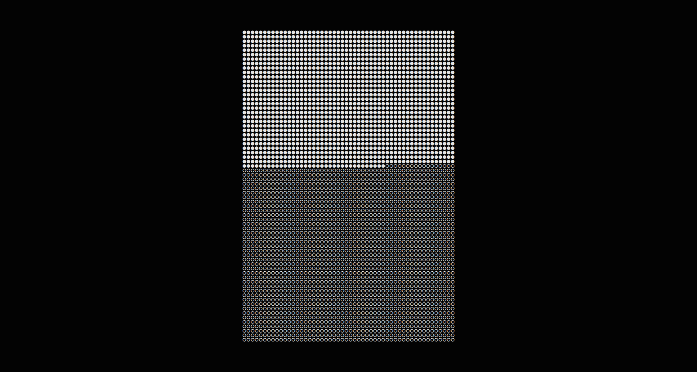 | [Github](//github.com/scillidan/LIVELY-resource/tree/master/marbles)  | [2977090712](//steamcommunity.com/sharedfiles/filedetails?id=2977090712)    |
| [gaea](//github.com/nomand/Gaea) | [nomand](//nomand.co/#nomand) | [MIT](//github.com/nomand/Gaea/blob/master/LICENSE.md)  | 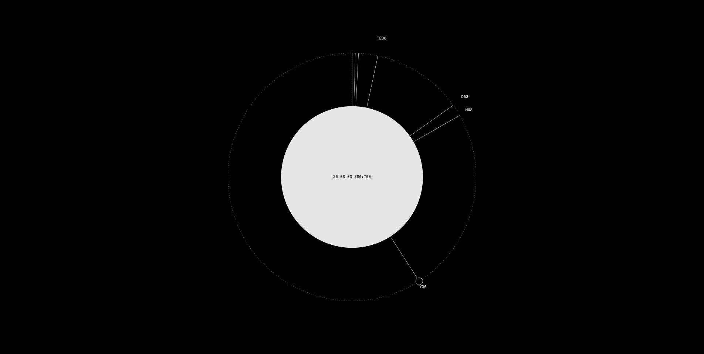 | [Github](//github.com/scillidan/LIVELY-resource/tree/master/gaea)  | [2977086339](//steamcommunity.com/sharedfiles/filedetails?id=2977086339)    |
| [mortem](//gitlab.com/joshavanier/mortem) | [josh avanier](//avanier.studio/josh) | [MIT](//gitlab.com/joshavanier/mortem/-/blob/master/LICENSE)  |  | [Gitlab](//gitlab.com/scillidan1/mortem)  | [2977081651](//steamcommunity.com/sharedfiles/filedetails?id=2977081651)    |
| [letnice](//github.com/nomand/Letnice) | [nomand](//nomand.co/#nomand) | [MIT](//github.com/nomand/Letnice/blob/master/LICENSE.md)  | 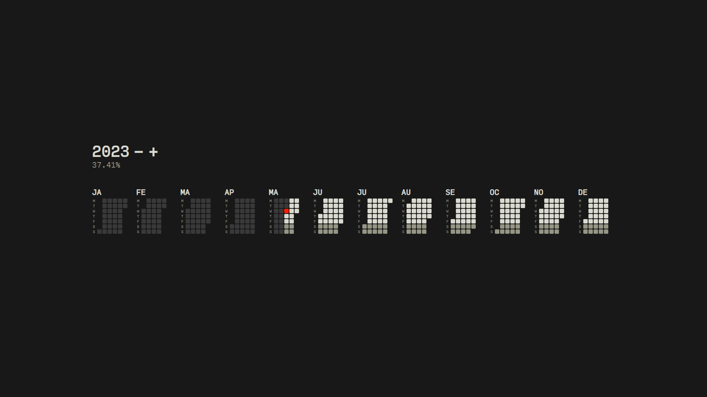 | [Gitlab](//gitlab.com/scillidan1/letnice)  | [2977074517](//steamcommunity.com/sharedfiles/filedetails?id=2977074517)    |
| [grid-chaos>order](//openprocessing.org/sketch/859877) | [Jin](//openprocessing.org/user/78622) | [CC BY-SA 3.0](//creativecommons.org/licenses/by-sa/3.0)  | 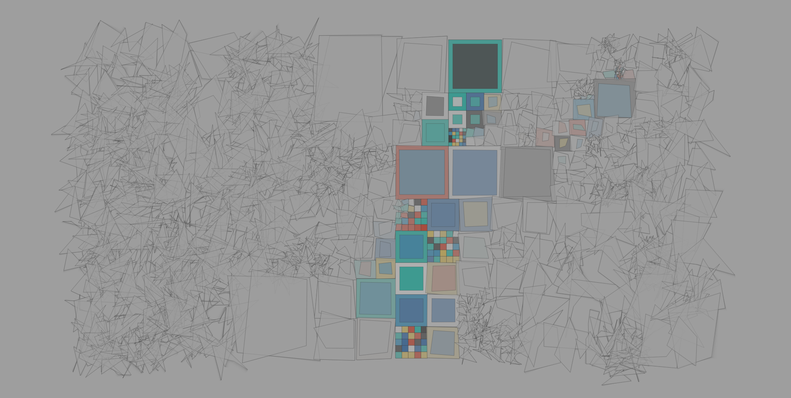 | [Github](//github.com/scillidan/LIVELY-resource/tree/master/grid-chaos-order)  | [2977070522](//steamcommunity.com/sharedfiles/filedetails?id=2977070522)    |
| [circular-labyrinth-generator](//codepen.io/JuanFuentes/pen/mgPZpb) | [Juan Fuentes](//codepen.io/JuanFuentes) | [MIT](//blog.codepen.io/documentation/licensing)  | 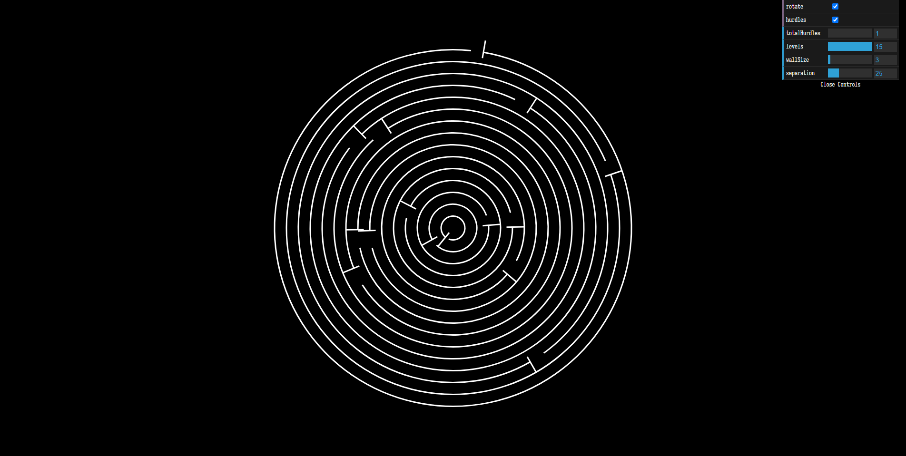 | [Github](//github.com/scillidan/LIVELY-resource/tree/master/circular-labyrinth-generator)  | [2977063640](//steamcommunity.com/sharedfiles/filedetails?id=2977063640)    |
| [blueberries](//codepen.io/soju22/pen/MWKJowb) | [Kevin Levron](//codepen.io/soju22) | [MIT](//blog.codepen.io/documentation/licensing)  | 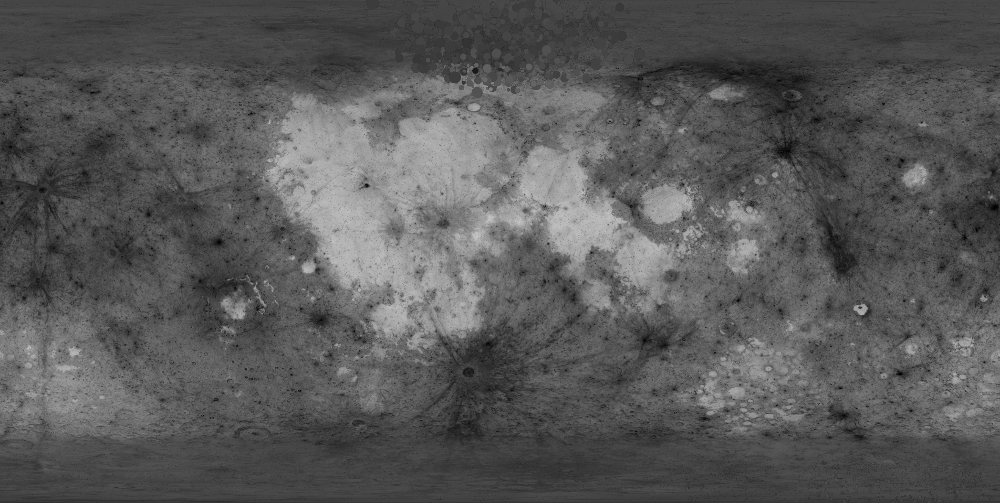 | [Github](//github.com/scillidan/LIVELY-resource/tree/master/blueberries)  | [2977057338](//steamcommunity.com/sharedfiles/filedetails?id=2977057338)    |
| [twinkly-sky](//codepen.io/swartkrans/pen/kPQaYR) | [swartkrans](//codepen.io/swartkrans) | [MIT](//blog.codepen.io/documentation/licensing)  | 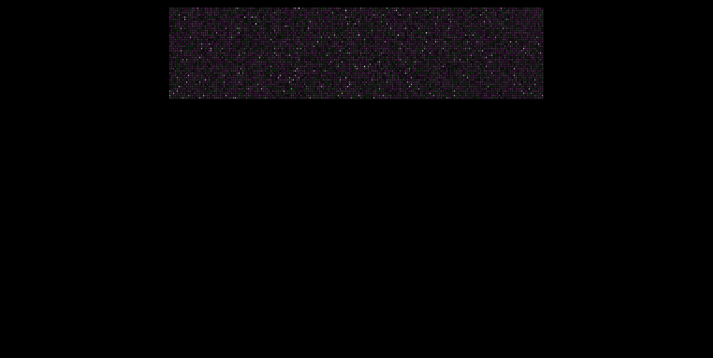 | [Github](//github.com/scillidan/LIVELY-resource/tree/master/twinkly-sky)  | [2977052849](//steamcommunity.com/sharedfiles/filedetails?id=2977052849)    |
| [pixelart-campfire](//codepen.io/jcoulterdesign/pen/yGgxOY) | [jcoulterdesign](//codepen.io/jcoulterdesign) | [MIT](//blog.codepen.io/documentation/licensing) | 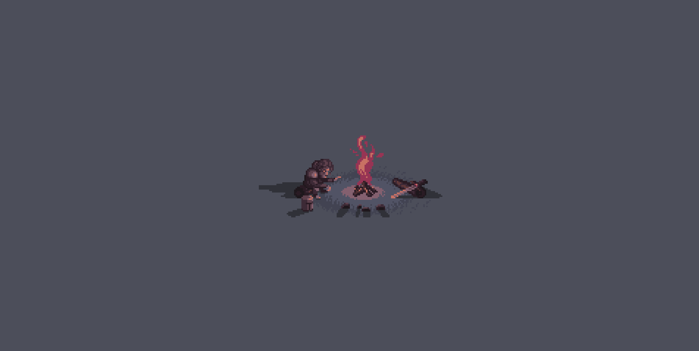 | [Github](//github.com/scillidan/LIVELY-resource/tree/master/pixelart-campfire) | [2977047266](//steamcommunity.com/sharedfiles/filedetails?id=2977047266)   |
| [AudioBasedImageDistortion](//github.com/neundex/AudioBasedImageDistortion) | [codrops](//tympanus.net/codrops) | [See #License](//github.com/neundex/AudioBasedImageDistortion#license)  | 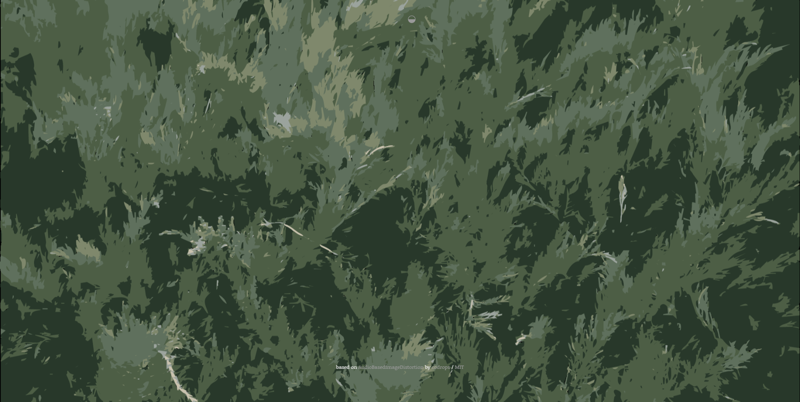 | [Github](//github.com/scillidan/grass)  | [2979494630](//steamcommunity.com/sharedfiles/filedetails?id=2979494630)    |
| [duskwave](//gist.github.com/mandynicole/f6c1c3083dd5dbb6606bd832f97a10c4) | [mandynicole](//github.com/mandynicole) | [No License](//choosealicense.com/no-permission)  | 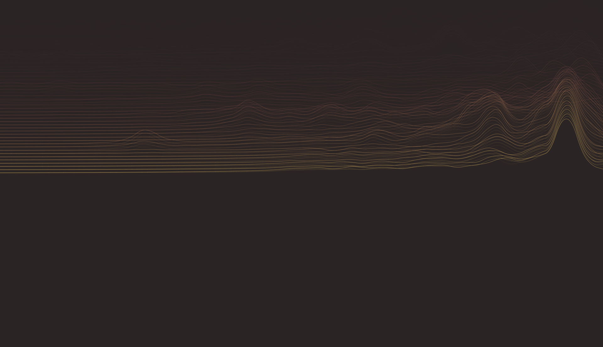 | [Gist](//gist.github.com/mandynicole/f6c1c3083dd5dbb6606bd832f97a10c4)  | [2583079348](//steamcommunity.com/sharedfiles/filedetails?id=2583079348)    |